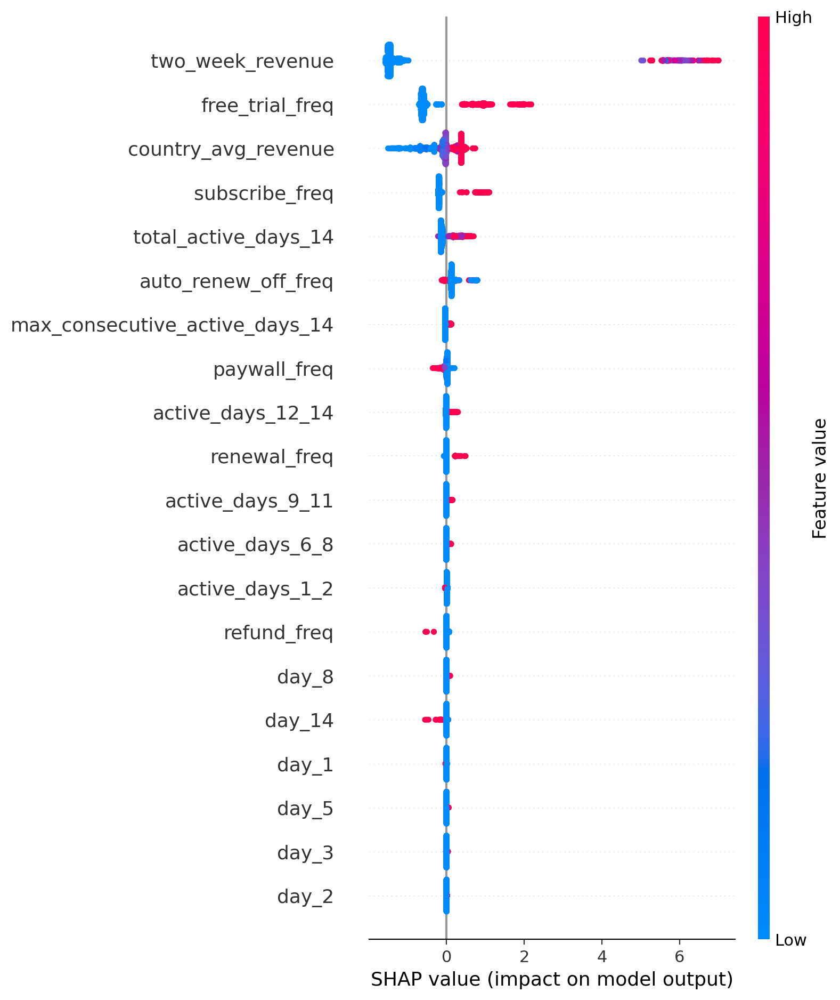
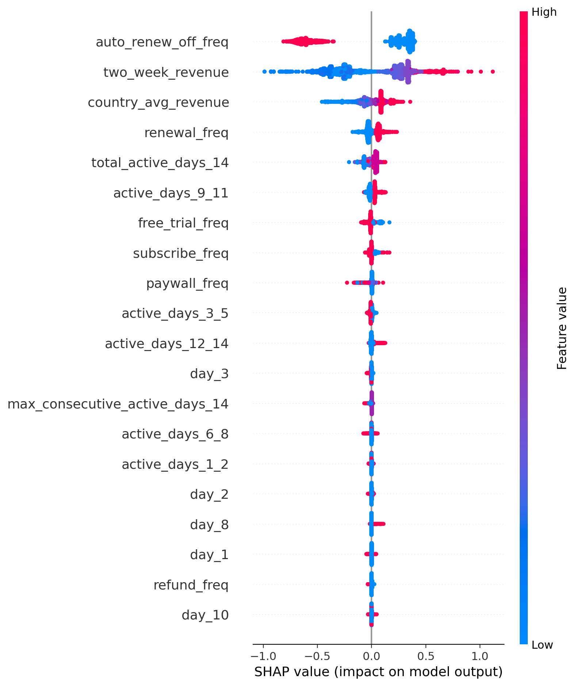

# LTV Prediction with a Zero-Inflated Hurdle Model (XGBoost)

## Project Overview

This project predicts **first-year customer Lifetime Value (LTV)** using only the first 15 days of user behavior.

A key challenge is that the dataset is **zero-inflated**:

- Most users generate **no revenue**
- A small fraction of payers generate the majority of revenue

To handle this, we build a **two-stage hurdle model**:

1. **Classifier** → predicts whether a user becomes a payer  
2. **Regressor** → predicts revenue *conditional on paying*  

Final expected LTV:

$$
\hat{LTV} = \hat{p}(\text{payer}) \cdot \hat{r}(\text{revenue} \mid \text{payer})
$$

---

## Features

All features are observed within the first 15 days:

- Engagement (`active_days_*`, streaks, total active days)
- Funnel events (`subscribe_freq`, `refund_freq`, etc.)
- Early monetization (`two_week_revenue`)
- Geographic baseline (`country_avg_revenue`)

---

## Train/Test Strategy

We apply a **temporal split** based on `first_event_date`:

- Train on earliest users  
- Validation on intermediate period  
- Test on most recent users  

This avoids future leakage and closely mimics deployment.

---

## Modeling Approach

### Stage 1: Payer Classification

- Model: `XGBClassifier`
- Metric: AUC ≈ 0.95, PR-AUC ≈ 0.88
- Probabilities calibrated using **isotonic regression**

### Stage 2: Conditional Revenue Regression

- Model: `XGBRegressor`
- Trained on:

$$
\log(1 + revenue_{\text{capped99}})
$$

---

## Calibration & Thresholding

### Probability Floor

To reduce false revenue assigned to non-payers:

$$
\hat{LTV}=0 \quad \text{if } \hat{p} < 0.01
$$

### Revenue Scaling

Predictions are scaled so that total predicted revenue matches true revenue:

$$
scale = \frac{\sum y}{\sum \hat{y}}
$$

---

## Target Engineering Results

| Target | MAE | NMAE | RMSE | Predicted Revenue on True Zeros |
|-------|-----|------|------|-------------------------------|
| Raw revenue | 2.39 | 0.89 | 14.12 | 74k |
| Capped 99% | 1.20 | 0.67 | 5.88 | 56k |
| **Capped 99% + log** | **1.14** | **0.64** | 6.08 | **14k** |

Final target choice:

$$
\log(1 + revenue_{\text{capped99}})
$$

---

## SHAP Interpretability

SHAP values were computed separately for both components of the hurdle model.

### Classifier Drivers

Top features:

- `two_week_revenue`
- `free_trial_freq`
- `subscribe_freq`
- `country_avg_revenue`
- `total_active_days_14`

SHAP summary plot:




---

### Regressor Drivers

Top features:

- `auto_renew_off_freq`
- `two_week_revenue`
- `country_avg_revenue`
- `renewal_freq`
- engagement streaks

SHAP summary plot:




---

## Revenue Capture Performance

Revenue captured by top predicted users:

| Segment | Revenue Captured |
|--------|------------------|
| Top 1% | 28.5% |
| Top 5% | 82.4% |
| Top 10% | 89.1% |
| Top 20% | 92.0% |


Cumulative revenue capture curve:


---

## Conclusion

This project delivers a production-style LTV system with:

- hurdle modeling for zero inflation  
- calibrated payer probabilities  
- capped-log revenue regression  
- revenue-consistent scaling  
- SHAP-based explainability  
- strong ranking utility for targeting  


---

## Repository Structure

```
ltv-prediction/
│
├── src/ltv/ # Core package
│ ├── pipeline/ # Train/predict orchestration
│ ├── models/ # Classifier, regressor, calibration
│ ├── features/ # Preprocessing + feature engineering
│ ├── evaluation/ # Metrics + revenue capture tools
│ ├── config.py # Paths + constants
│ └── logging.py # Logging utilities
│
├── scripts/
│ ├── train.py # Run training pipeline
│ └── predict.py # Run prediction pipeline (--clean supported)
│
├── data/
│ ├── raw/ # Raw event-level parquet files
│ ├── input/ # Prediction-time input files
│ └── output/ # Saved predictions
│
├── models/ # Saved hurdle model bundle
├── reports/ # SHAP plots + evaluation figures
├── notebooks/ # Development + experimentation notebooks
└── README.md
```

---

## Usage

### 1. Install

From the project root:

```
pip install -e .
````

### 2. Training

Run the full training pipeline:

```
python scripts/train.py
```

Training inputs:
- Raw parquet file: `data/raw/ltv_prediction_raw.parquet`

Training outputs:
- Saved model bundle: ```models/ltv_bundle.pkl```
- Logs: ```logs/pipeline.log```

### 3. Prediction

Run prediction using a trained model:

```
python scripts/predict.py
```

If prediction input requires preprocessing:

```
python scripts/predict.py --clean
```

Prediction inputs:
- Processed parquet file: `data/input/ltv_prediction_input.parquet`

Or
- Raw parquet file: `data/input/ltv_prediction_input_raw.parquet`

Prediction outputs:

- User-level predictions: ```data/outputs/ltvprediction_users.parquet```
- Cohort-level predictions: ```data/outputs/ltvprediction_cohort.parquet```

### 4. Data

The `data/` folder comes with sample Parquet files. These are just small subsets so you can see the structure of the data, they’re not really meant for training.

That said, if you still want to use them for experiments, you’ll need to:

- either remove the `sample` part from the filenames,
- or adjust the paths in your config and notebooks accordingly.

The **original data folder** (used during model training and notebook experiments) has been compressed into a single archive and can be downloaded [here](https://drive.google.com/file/d/1qIs4lAYSMoA33X0Qy2hD5WyDBd7aftji/view?usp=sharing).


## Notes

- Make sure parquet formatted raw data is placed in ```data/raw/``` before training.

- Make sure parquet formatted input data is placed in ```data/input/``` before predicting.

- You can configure file paths and parameters in ```src/ltv/config.py```

- There are two Jupyter Notebook files available for you to explore how this model is developed. Please check ```notebooks``` folder.

